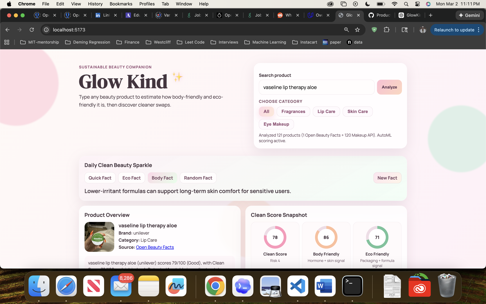
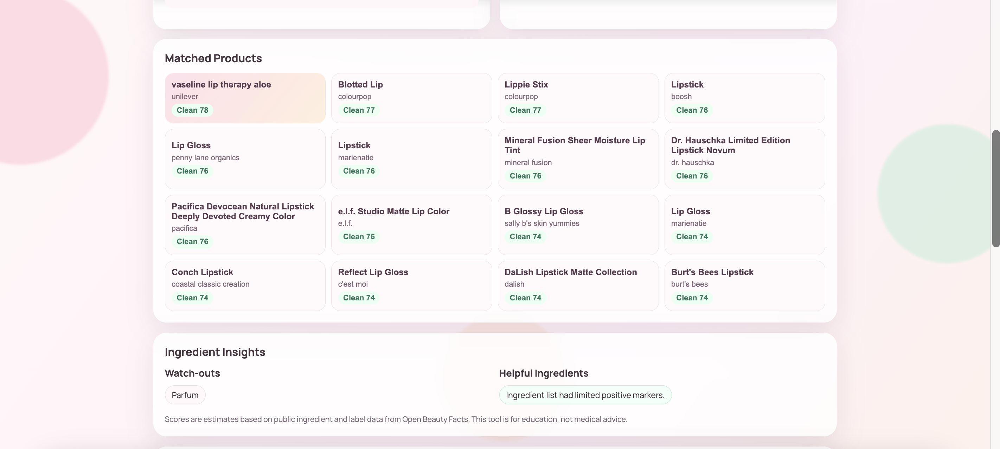
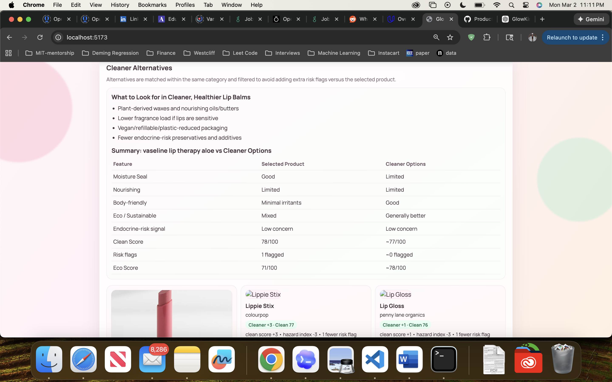
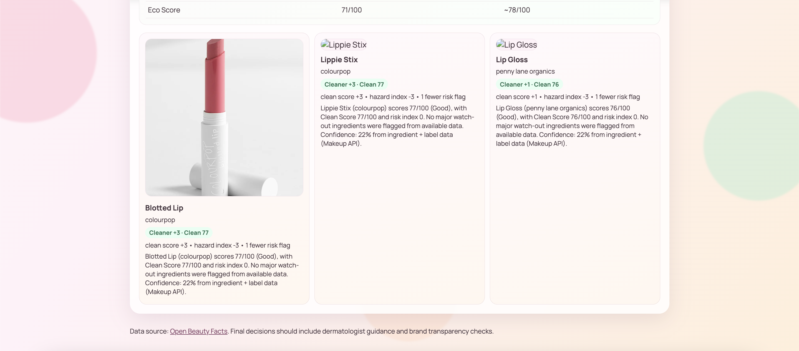

# GlowKind

GlowKind is an AI-assisted beauty product discovery and sustainability platform focused on helping people make cleaner, smarter product choices.

It allows a user to search for beauty products, review ingredient and packaging signals, understand how body-friendly and eco-friendly a product may be, and compare it against safer alternatives in the same category.

## Product Preview

### Search, product summary, and score view

### Matched products and product browsing

### Cleaner alternatives comparison

  
  

## What GlowKind Does

GlowKind is designed to answer a practical question:

**If I am about to buy this beauty product, how clean is it for my body, how responsible is it for the environment, and are there better alternatives?**

The app is built for beauty categories such as:

- Fragrances
- Lip Care
- Skin Care
- Eye Makeup

## Why It Is Useful

Beauty shopping is often driven by branding, trends, and marketing claims, but product safety and sustainability are usually harder to evaluate quickly.

GlowKind helps by turning scattered product information into a clearer decision system. The idea came from my own experience of doing this the hard way for a long time. For the past year and a half, I have been the kind of person who reads labels, cross-checks ingredients, and compares products across multiple sources before I buy anything. I have also been experimenting with different large language models and tools like ChatGPT and Gemini to speed up that research, but I still found myself doing the same repetitive work every single time, and I realized how inaccessible this process is for most people.

That is exactly what GlowKind is built to solve:

- It highlights ingredient watch-outs in plain language.
- It estimates product risk and sustainability signals using consistent criteria.
- It surfaces cleaner alternatives within the same category, not just generic “clean” suggestions.
- It gives users an intuitive way to compare products beyond marketing language, so they can make decisions faster and with more confidence.

GlowKind is essentially the system I wished existed while I was doing all that research manually. I wanted to take something that started as my personal process and turn it into something bigger and genuinely useful for anyone who cares about health, hormones, and the environment, but does not have the time to do deep research for every purchase.

## Core Scoring System

GlowKind uses a multi-layer scoring framework to make product comparison easier to understand.

### Body Friendly

This score estimates how suitable a product may be from a body-safety perspective.

It considers signals such as:

- endocrine-disruption related ingredients
- irritants and harsh preservatives
- fragrance load
- beneficial ingredients and barrier-supportive markers
- ingredient transparency and completeness

### Eco Friendly

This score estimates the product's environmental profile.

It considers signals such as:

- eco-risk ingredients
- packaging signals like plastic, refill, recycled materials, or aluminum
- eco labels and sustainability markers
- public eco score information when available

### Clean Score

This is the main blended score.

It combines body-related and eco-related signals into one easier overall indicator for everyday comparison.

### Risk Index

This represents the severity of flagged ingredient concerns.

A lower value is better.

It is intended to help users understand whether a product has relatively low, moderate, or stronger watch-out signals.

## Machine Learning Layer

GlowKind includes a Python-based ML scoring backend built with FastAPI and scikit-learn.

This layer does more than simple keyword matching.

It:

- extracts structured product features from ingredients, packaging, labels, and category context
- evaluates risk patterns across multiple dimensions
- uses an AutoML-style model selection approach to choose strong regressors for score prediction
- improves product ordering and comparison quality over a purely manual scoring pipeline

The ML system is used to support predictions for:

- Body Friendly score
- Eco Friendly score
- Clean Score
- Risk Index

This makes the comparison system more adaptive and more consistent across product types.

## Cleaner Alternative Logic

GlowKind does not suggest alternatives randomly.

Its comparison logic is intentionally constrained so that alternatives are more meaningful.

Cleaner alternatives are:

- matched within the same product category
- compared using score, risk, ingredient, and eco signals
- filtered to avoid introducing additional risk flags compared to the selected product whenever possible

The goal is not just to recommend a different product, but to recommend a **better decision**.

## Data Sources

GlowKind works with public product information sources, including:

- Open Beauty Facts
- Makeup API

These sources provide ingredient, packaging, labeling, and product listing data used for analysis.

## Project Structure

This repository includes:

- Frontend UI built with HTML, CSS, and JavaScript
- Python FastAPI backend for scoring and model-backed analysis
- ML training and scoring pipeline using scikit-learn
- Trained model artifact used by the backend for product scoring

## Technologies Used

- Python
- FastAPI
- scikit-learn
- JavaScript
- HTML
- CSS

## Notes

- GlowKind is intended for education and product comparison, not medical diagnosis or treatment.
- Product confidence can vary depending on how complete the public ingredient and packaging data is.
- Machine learning improves the scoring workflow, but output quality still depends on the quality of available product data.

## Author

Created by **Shwetha Tinnium Raju**
